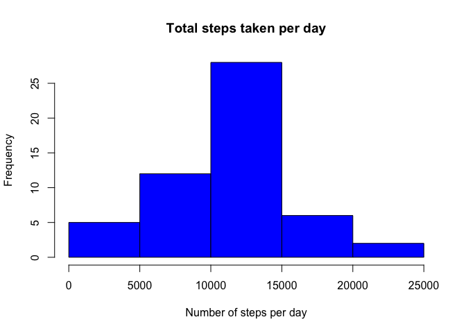
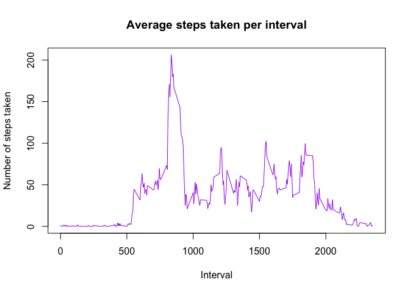
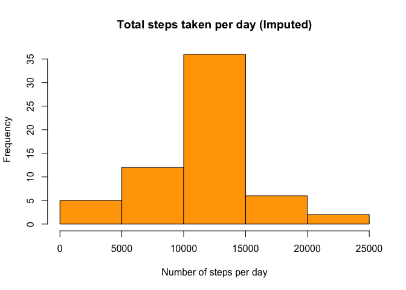
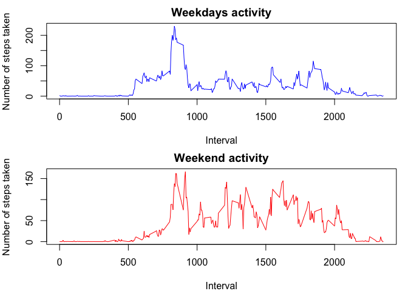

## Loading and preprocessing the data
The data was loaded using the following code:-

```r
activity.data = read.csv("~/Downloads/Coursera/Reproducible_research/RepData_PeerAssessment1-master/activity.csv", header= T, sep = ",")
head(activity.data)
```

```
##   steps       date interval
## 1    NA 2012-10-01        0
## 2    NA 2012-10-01        5
## 3    NA 2012-10-01       10
## 4    NA 2012-10-01       15
## 5    NA 2012-10-01       20
## 6    NA 2012-10-01       25
```

```r
str(activity.data)
```

```
## 'data.frame':	17568 obs. of  3 variables:
##  $ steps   : int  NA NA NA NA NA NA NA NA NA NA ...
##  $ date    : Factor w/ 61 levels "2012-10-01","2012-10-02",..: 1 1 1 1 1 1 1 1 1 1 ...
##  $ interval: int  0 5 10 15 20 25 30 35 40 45 ...
```

```r
summary(activity.data)
```

```
##      steps                date          interval     
##  Min.   :  0.00   2012-10-01:  288   Min.   :   0.0  
##  1st Qu.:  0.00   2012-10-02:  288   1st Qu.: 588.8  
##  Median :  0.00   2012-10-03:  288   Median :1177.5  
##  Mean   : 37.38   2012-10-04:  288   Mean   :1177.5  
##  3rd Qu.: 12.00   2012-10-05:  288   3rd Qu.:1766.2  
##  Max.   :806.00   2012-10-06:  288   Max.   :2355.0  
##  NA's   :2304     (Other)   :15840
```


## What is mean total number of steps taken per day?
For this,  the steps taken each day has to be combined as one observation as the data set has observtions based on intervals. So, in original dataset we have same day but many observations. 

### Total number of steps taken per day. Following code was used:-

```r
steps_day = aggregate(steps ~ date, data = activity.data, FUN=sum, na.rm = T)
```
### Histogram of total steps taken each day

```r
hist(steps_day$steps, xlab = "Number of steps per day", main = "Total steps taken per day", col = "blue")
```

<!-- -->

### Mean of the total number of steps taken per day

```r
mean_steps_day = mean(steps_day$steps)
mean_steps_day
```

```
## [1] 10766.19
```

### Median of the total number of steps taken per day

```r
median_steps_day = median(steps_day$steps)
median_steps_day
```

```
## [1] 10765
```


## What is the average daily activity pattern?
## What is the average daily activity pattern?
For this part, number of steps taken was averaged per interval and a time series plot was made, using the following code:- 

```r
meanstepsperinterval = aggregate(steps ~ interval, data = activity.data, FUN=mean, na.rm = T)
plot(meanstepsperinterval$interval, meanstepsperinterval$steps, type = "l", xlab= "Interval", ylab = "Number of steps taken", main = "Average steps taken per interval", col = "purple")
```

<!-- -->

### Which 5-minute interval, on average across all the days in the dataset, contains the maximum number of steps?
For this part, following ccode was used to identify whic row has the maximum number of steps:-

```r
which.max(meanstepsperinterval$steps)  
```

```
## [1] 104
```
Now we will see the observations in this row using:- 

```r
meanstepsperinterval[104, ]
```

```
##     interval    steps
## 104      835 206.1698
```
**Maximum number of steps over 5 minute interval are 206 corrsponing to 835th interval**


## Imputing missing values
### Number of NAs was calculated using :-

```r
sum(is.na(activity.data))
```

```
## [1] 2304
```

### For filling in all of the missing values in the dataset mean number of steps per interval across all days was considered. 
The original dataset was subsetted into 2 datasets depending on the presence and absence of NAs. Missing values were imputed based on nthe mean steps per interval and the datasets were joined.

```r
steps_interval_mean = tapply(activity.data$steps, activity.data$interval, mean, na.rm = TRUE)
NAs_data = activity.data[is.na(activity.data$steps), ]
Complete_data = activity.data[complete.cases(activity.data$steps), ]
NAs_data$steps <- as.factor(NAs_data$interval)
levels(NAs_data$steps) <- steps_interval_mean
NAs_data$steps <- as.integer(as.vector(NAs_data$steps))
imputed_data = rbind(NAs_data, Complete_data)
```

### Histogram of the total number of steps taken each day after imputation
For this, all the observations per day were combined using,

```r
imputed_data_day = aggregate(steps~date, data = imputed_data, FUN=sum)
hist(imputed_data_day$steps, xlab = "Number of steps per day", main = "Total steps taken per day (Imputed)", col = "orange")
```

<!-- -->
### For mean and median following codes were used:-

```r
mean_imputed = mean(imputed_data_day$steps)
mean_imputed
```

```
## [1] 10749.77
```

```r
median_imputed = median(imputed_data_day$steps)
median_imputed
```

```
## [1] 10641
```
To appreciate the difference between means and medians of the data before after imputation, these can be arranged into a dataframe

```r
comparison_before_after_imputation = data.frame(c(mean_steps_day, median_steps_day), c(mean_imputed, median_imputed))
colnames(comparison_before_after_imputation) = c("before imputation", "after imputation")
rownames(comparison_before_after_imputation) = c("mean", "median")
comparison_before_after_imputation
```

```
##        before imputation after imputation
## mean            10766.19         10749.77
## median          10765.00         10641.00
```

**As evident from above, mean has not changed much, median value has somewhat reduced after imputation.**


## Are there differences in activity patterns between weekdays and weekends?
### A new factor variable in the dataset 
It was created indicating the day of the week corresponding to the date in imputed dataset. Then, this dataset was subsetted based on whether the days correspond to weekdays or weekends. using 

```r
imputed_data$weekday <- format(as.Date(imputed_data$date), "%a")
imputed_weekend = subset(imputed_data,imputed_data$weekday == "Sat" | imputed_data$weekday == "Sun")
imputed_weekday=  subset(imputed_data,imputed_data$weekday != "Sat" & imputed_data$weekday != "Sun")
head(imputed_weekday)
```

```
##   steps       date interval weekday
## 1     1 2012-10-01        0     Mon
## 2     0 2012-10-01        5     Mon
## 3     0 2012-10-01       10     Mon
## 4     0 2012-10-01       15     Mon
## 5     0 2012-10-01       20     Mon
## 6     2 2012-10-01       25     Mon
```

```r
head(imputed_weekend)
```

```
##      steps       date interval weekday
## 9793     1 2012-11-04        0     Sun
## 9794     0 2012-11-04        5     Sun
## 9795     0 2012-11-04       10     Sun
## 9796     0 2012-11-04       15     Sun
## 9797     0 2012-11-04       20     Sun
## 9798     2 2012-11-04       25     Sun
```
### Panel plot containing a time series plot
Average number of steps taken, averaged across all days  were determined using;-

```r
weekday = aggregate(steps~interval, data = imputed_weekday, FUN=mean)
weekend = aggregate(steps~interval, data = imputed_weekend, FUN=mean)
```
Then a panel plot was created using:- 

```r
par(mfrow = c(2,1), mar= c(4,4,2,1))
plot(weekday$interval, weekday$steps, type = "l", col = "blue", xlab = "Interval", ylab = "Number of steps taken", main = "Weekdays activity")
plot(weekend$interval, weekend$steps, type = "l", col = "red", xlab = "Interval", ylab = "Number of steps taken", main = "Weekend activity")
```

<!-- -->

**Yes, there are differences in activity patterns between weekdays and weekends.**
